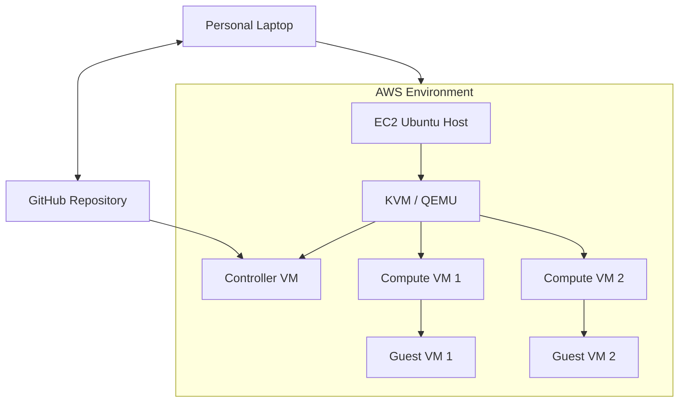

# AWS Deployment Architecture

```mermaid
flowchart TB
    LAP["Personal Laptop"]
    LAP --> AWS

    subgraph AWS["AWS Environment"]
        EC2["EC2 Ubuntu Host"]
        EC2 --> HV["KVM / QEMU"]
        HV --> C["Controller VM"]
        HV --> N1["Compute VM 1"]
        HV --> N2["Compute VM 2"]
        N1 --> VM1["Guest VM 1"]
        N2 --> VM2["Guest VM 2"]
    end

    GH["GitHub Repository"]
    LAP <--> GH
    GH --> C
```
