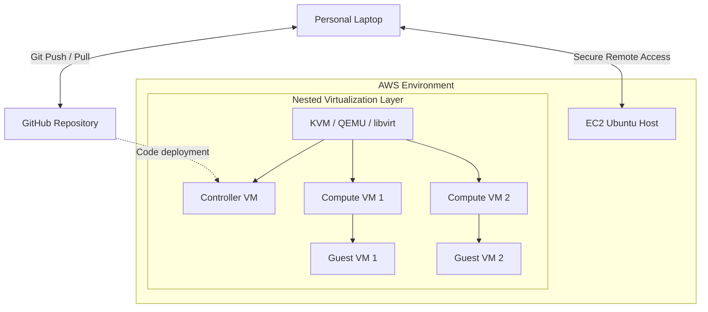

# AWS Deployment Architecture

```mermaid
flowchart TB
    LAP["Personal Laptop"] <-->|"Secure Remote Access"| EC2

    subgraph AWS["AWS Environment"]
        EC2["EC2 Ubuntu Host"]

        subgraph NESTED["Nested Virtualization Layer"]
            HV["KVM / QEMU / libvirt"]
            HV --> C["Controller VM"]
            HV --> N1["Compute VM 1"]
            HV --> N2["Compute VM 2"]

            N1 --> VM1["Guest VM 1"]
            N2 --> VM2["Guest VM 2"]
        end
    end

    LAP <-->|"Git Push / Pull"| GH["GitHub Repository"]
    GH -.->|"Code deployment"| C
```
