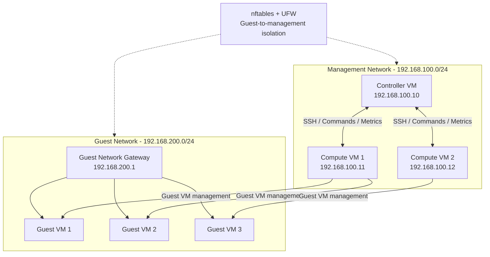

# Network Architecture

```mermaid
flowchart TB
    subgraph MGMT["Management Network - 192.168.100.0/24"]
        C["Controller VM\n192.168.100.10"]
        N1["Compute VM 1\n192.168.100.11"]
        N2["Compute VM 2\n192.168.100.12"]

        C <-->|"SSH / Commands / Metrics"| N1
        C <-->|"SSH / Commands / Metrics"| N2
    end

    subgraph GUEST["Guest Network - 192.168.200.0/24"]
        GW["Guest Network Gateway\n192.168.200.1"]
        VM1["Guest VM 1"]
        VM2["Guest VM 2"]
        VM3["Guest VM 3"]

        GW --> VM1
        GW --> VM2
        GW --> VM3
    end

    N1 -->|"Guest VM management"| VM1
    N1 -->|"Guest VM management"| VM2
    N2 -->|"Guest VM management"| VM3

    SEC["nftables + UFW\nGuest-to-management isolation"]
    SEC -.-> GUEST
    SEC -.-> MGMT

```
