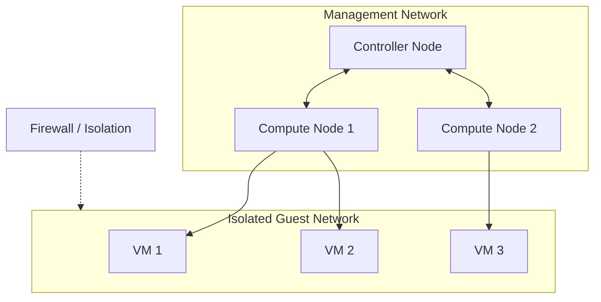

# Network Architecture

```mermaid
flowchart TB
    subgraph MGMT["Management Network"]
        C["Controller Node"]
        N1["Compute Node 1"]
        N2["Compute Node 2"]
        C <--> N1
        C <--> N2
    end

    subgraph GUEST["Isolated Guest Network"]
        VM1["VM 1"]
        VM2["VM 2"]
        VM3["VM 3"]
    end

    N1 --> VM1
    N1 --> VM2
    N2 --> VM3

    FW["Firewall / Isolation"]
    FW -.-> GUEST
```
