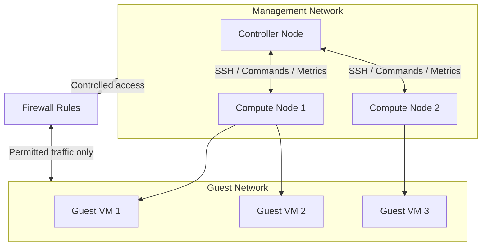

# Network Architecture

```mermaid
flowchart TB
    subgraph MGMT["Management Network"]
        C["Controller Node"]
        N1["Compute Node 1"]
        N2["Compute Node 2"]
        C <-->|"SSH / Commands / Metrics"| N1
        C <-->|"SSH / Commands / Metrics"| N2
    end

    subgraph GUEST["Guest Network"]
        VM1["Guest VM 1"]
        VM2["Guest VM 2"]
        VM3["Guest VM 3"]
    end

    N1 --> VM1
    N1 --> VM2
    N2 --> VM3

    FW["Firewall Rules"]
    MGMT <-->|"Controlled access"| FW
    FW <-->|"Permitted traffic only"| GUEST
```
