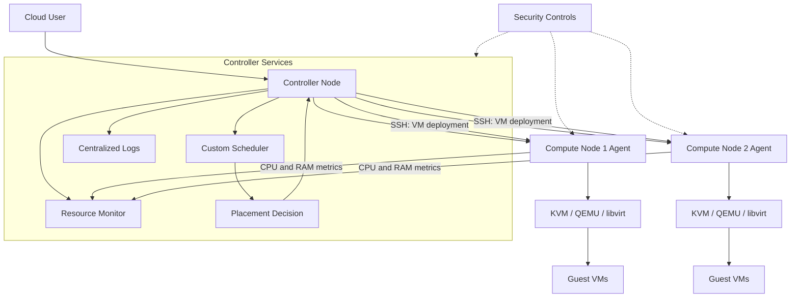

# System Architecture

```mermaid
flowchart TB
    U["Cloud User"] --> C["Controller Node"]

    subgraph CTRL["Controller Services"]
        C --> S["Custom Scheduler"]
        C --> M["Resource Monitor"]
        C --> L["Centralized Logs"]
        S --> P["Placement Decision"]
    end

    P --> C

    C --> A1["Compute Node 1 Agent"]
    C --> A2["Compute Node 2 Agent"]

    C -->|"SSH: VM deployment"| A1
    C -->|"SSH: VM deployment"| A2

    A1 --> H1["KVM / QEMU / libvirt"]
    A2 --> H2["KVM / QEMU / libvirt"]

    H1 --> V1["Guest VMs"]
    H2 --> V2["Guest VMs"]

    A1 -->|"CPU and RAM metrics"| M
    A2 -->|"CPU and RAM metrics"| M

    SEC["Security Controls"] -.-> CTRL
    SEC -.-> A1
    SEC -.-> A2
```
