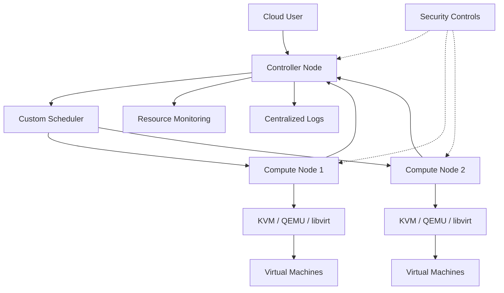

# System Architecture

```mermaid
flowchart TB
    U["Cloud User"] --> C["Controller Node"]
    C --> S["Custom Scheduler"]
    C --> M["Resource Monitoring"]
    C --> L["Centralized Logs"]
    S --> N1["Compute Node 1"]
    S --> N2["Compute Node 2"]
    N1 --> H1["KVM / QEMU / libvirt"]
    N2 --> H2["KVM / QEMU / libvirt"]
    H1 --> V1["Virtual Machines"]
    H2 --> V2["Virtual Machines"]
    SEC["Security Controls"] -.-> C
    SEC -.-> N1
    SEC -.-> N2
    N1 --> C
    N2 --> C
```
